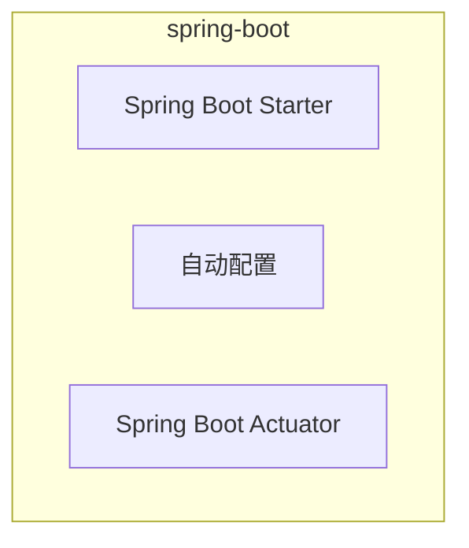

[TOC]

# spring-boot

## 总览



《Spring实战 第4版》

- [x] 第21章 借助SpringBoot简化Spring开发

## spring-boot-starter

合并依赖

## 自动配置

## Actuator

## 构建应用

pom文件

```xml
<?xml version="1.0" encoding="UTF-8"?>
<project>
    <parent>
        <groupId>org.springframework.boot</groupId>
        <artifactId>spring-boot-starter-parent</artifactId>
        <version>xx</version>
    </parent>
    <build>
        <plugins>
            <plugin>
                <groupId>org.springframework.boot</groupId>
                <artifactId>spring-boot-maven-plugin</artifactId>
            </plugin>
        </plugins>
    </build>
</project>
```

启动类

```java
@SpringBootApplication
public class Application {
    public static void main(String[] args) {
        SpringApplication.run(Application.class, args);
    }
}
```
