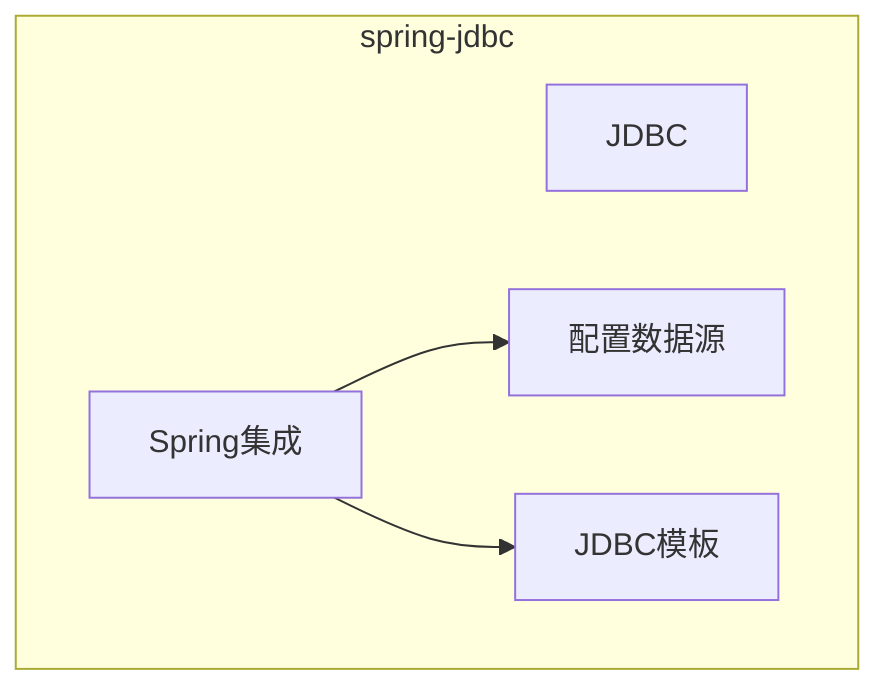
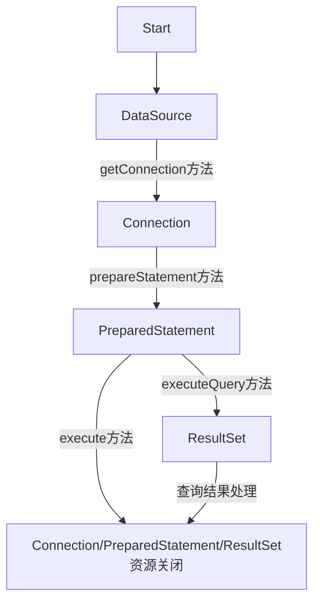

[TOC]

# spring-jdbc

## 总览

《Spring实战 第4版》

- [x] 第10章 通过Spring和JDBC征服数据库

### JDBC

> 执行图中各类方法会抛出SQLException

### spring集成

#### 配置数据源

- 连接池数据源（Hikari，Druid）
- JNDI数据源

#### JDBC模板

- JdbcTemplate（JdbcOperations）
- NamedParameterJdbcTemplate（NamedParameterJdbcOperations）
