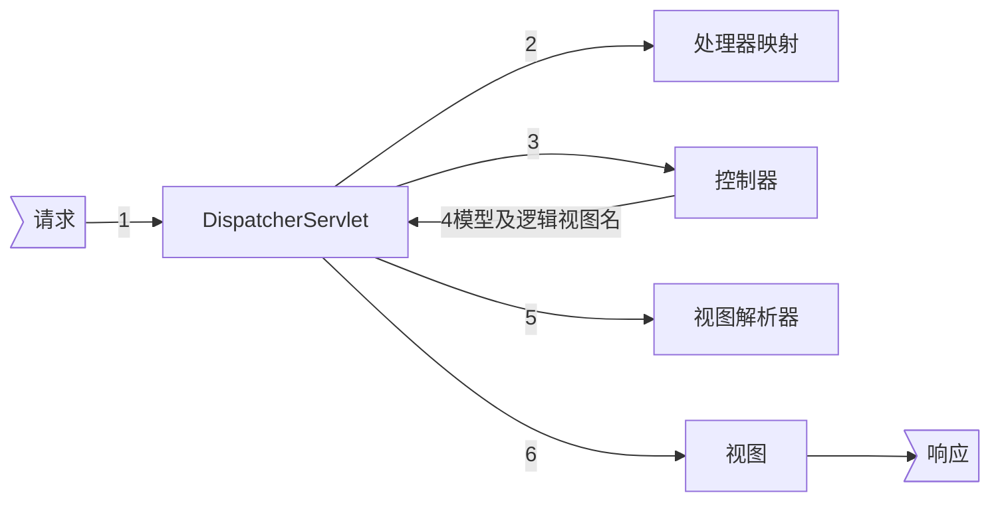

[TOC]

# spring-mvc

## 总览

《Spring实战 第4版》

- [x] 第5章 构建Spring Web应用程序
- [x] ~~第6章 渲染Web视图~~
- [x] 第7章 Spring MVC的高级技术
- [x] 第16章 使用SpringMVC创建REST API

## 请求流程图

## 控制器

1. 类级别：@Controller+@RequestMapping
2. 方法级别：@RequestMapping

### 请求输入

均在方法参数级别上

1. 查询参数（@RequestParam）
2. 表单参数
3. 路径参数（@PathVariable）

#### 表单参数校验

1. @Valid（控制器方法参数）
2. 校验注解（模型属性）

### 文件上传

@RequestPart+MultipartFile/Part

### 异常处理

1. 异常类添加@ResponseStatus

2. @ExceptionHandler注解控制器方法

> 注意：@ExceptionHandler能处理同个控制器中所有处理器方法抛出的异常，如果需要能够处理所有控制器中处理器方法抛出的异常，需要使用控制器通知（带有@ControllerAdvice注解的类）

## HTTP信息转换器HttpMethodConverter

- @RestController
- @ResponseBody
- @RequestBody
- @RestControllerAdvice

### 提供资源以外的其他内容

#### 错误

1. 控制器方法返回ResponseEntity
2. 异常处理器+ResponseEntity

> 如果仅更改HTTP状态可以在异常处理方法中使用@ReponseStatus

## RestTemplate
