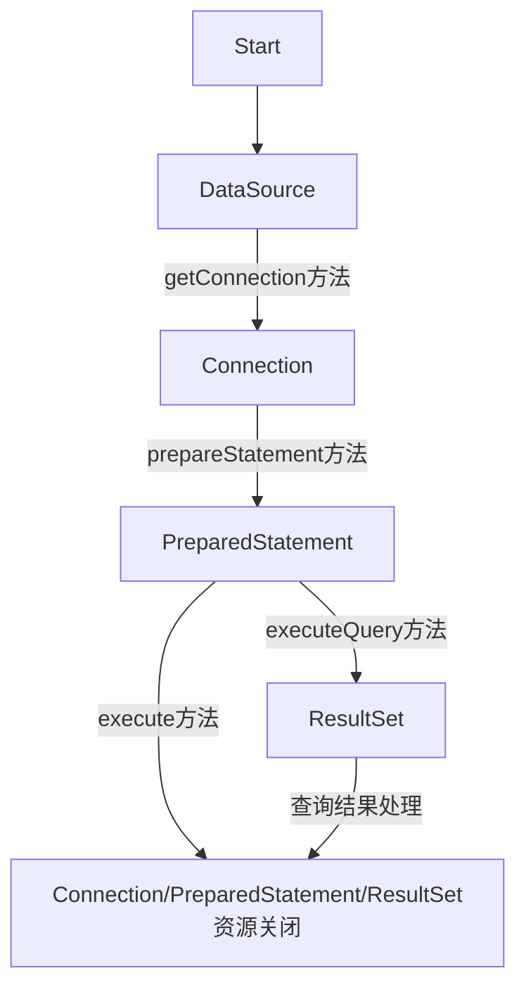

[TOC]

# Spring

## MVC

### 请求流程图

### 控制器

1. 类级别：@Controller+@RequestMapping
2. 方法级别：@RequestMapping

#### 请求输入

均在方法参数级别上

1. 查询参数（@RequestParam）
2. 表单参数
3. 路径参数（@PathVariable）

##### 表单参数校验

1. @Valid（控制器方法参数）
2. 校验注解（模型属性）

#### 文件上传

@RequestPart+MultipartFile/Part

#### 异常处理

1. 异常类添加@ResponseStatus

2. @ExceptionHandler注解方法

> 注意：@ExceptionHandler能处理同个控制器中所有处理器方法抛出的异常，如果需要能够处理所有控制器中处理器方法抛出的异常，需要使用控制器通知（带有@ControllerAdvice注解的类）

## Spring-JDBC

### 配置数据源

- 连接池数据源（Hikari，Druid）
- JNDI数据源

### JDBC模板

- JdbcTemplate（JdbcOperations）
- NamedParameterJdbcTemplate（NamedParameterJdbcOperations）

### JDBC

> 执行图中各类方法会抛出SQLException

## 注意事项

> 路线图、第2部分、Servlet-Filter-Listener
