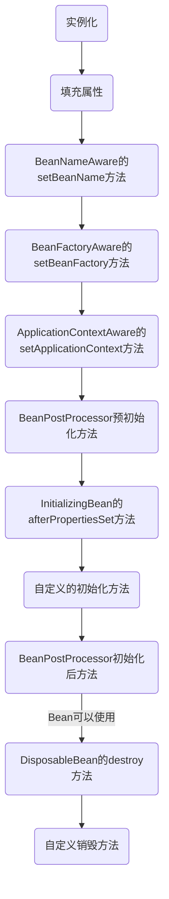

[TOC]

# Spring

## 依赖注入

### Bean容器

#### BeanFactory和ApplicationContext

#### 生命周期

### 装配

1. 隐式装配

> 组件扫描（@ComponentScan+@Component）+自动装配（@Autowired）

2. 显式装配

> @Configuration+@Bean

### 导入配置

@Import

## 注意事项

> 路线图、第一部分 spring的核心
