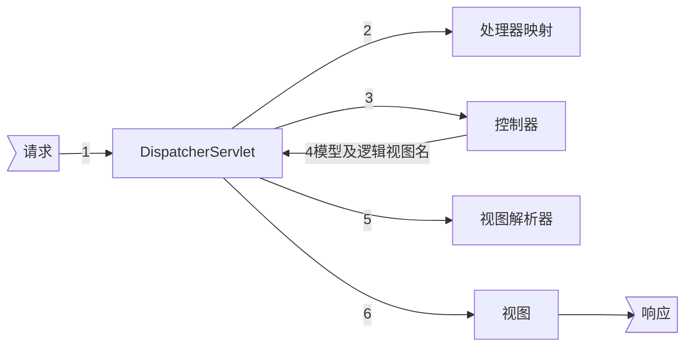

[TOC]

# Spring

## 依赖注入

### Bean容器

#### BeanFactory和ApplicationContext

#### 生命周期

### 装配

1. 隐式装配

> 组件扫描（@ComponentScan+@Component）+自动装配（@Autowired）

2. 显式装配

> @Configuration+@Bean

#### 导入配置

@Import

### 高级装配

#### 环境

@Profile+属性（spring.profiles.active和spring.profiles.default）

> 基于@Conditional实现

#### 自动装配歧义性问题

1. @Primary
2. @Qualifier

#### bean作用域

@Scope

1. 单例
2. 原型
3. 会话
4. 请求

> 使用会话或请求作用域时需要指明proxyMode以解决注入单例bean中所遇到的问题

#### 运行时值注入

@PropertySource声明属性源

1. Environment
2. @Value
3. SpEL

## 面向切面编程AOP

### 切面

@Aspect

### 切点

@Pointcut

### 通知

1. @Before、@After、@AfterReturning、@AfterThrowing
2. @Around(ProceedingJoinPoint)

## MVC

### 请求流程图

### 控制器

1. 类级别：@Controller+@RequestMapping
2. 方法级别：@RequestMapping

#### 请求输入

均在方法参数级别上

1. 查询参数（@RequestParam）
2. 表单参数
3. 路径参数（@PathVariable）

##### 表单参数校验

1. @Valid（控制器方法参数）
2. 校验注解（模型属性）

## 注意事项

> 路线图、第2部分
