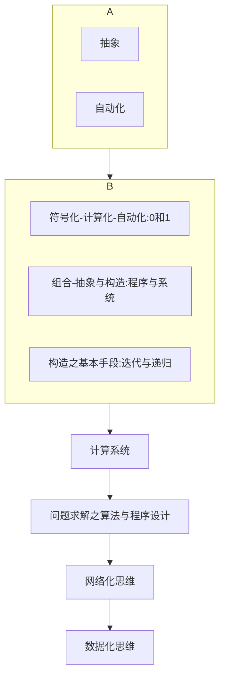

[TOC]

# 计算机专业导论

## 计算

- 机器-自动计算
  1. 程序与系统
  2. 语言与编译
  3. 问题->算法->程序
- 机器-难于计算

## 知识构建次序

```mermaid
flowchart TB

subgraph A
  抽象
  自动化
end

subgraph B
  符号化-计算化-自动化:0和1
  组合-抽象与构造:程序与系统
  构造之基本手段:迭代与递归
end

C[计算系统]
D[问题求解之算法与程序设计]
E[网络化思维]
F[数据化思维]

A-->B-->C-->D-->E-->F

```
