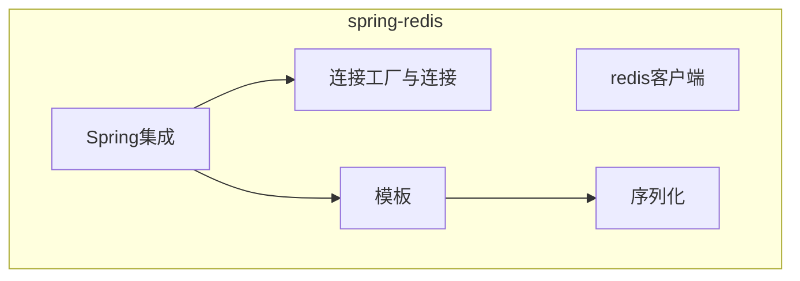

[TOC]

# spring-redis

## 总览

《Spring实战 第4版》

- [x] 第12章 使用NoSQL数据库

## redis客户端

- Jedis
- Lettuce
- Redisson

## spring集成

### 连接工厂与连接

RedisConnectionFactory与RedisConnection

> Spring提供了JedisConnectionFactory和LuttuceConnectionFactory

### 模板

- RedisTemplate
- StringRedisTemplate

#### 序列化器RedisSerializer

RedisTemplat用了JdkSerializationRedisSerializer
StringRedisTemplate使用了StringRedisSerializer
